test
# Protokoll Beschreibung (comprotocol)
===========

Ein sehr einfach gehaltenes Kommunikationsprotokoll. Das Protokoll wird für schulische Zwecke genutzt und dient zum lernen.

code api

## Protokoll Aufbau

Des Prtokoll ist wie folgt aufgebaut:

1. Entweder kann man einfach einen Command senden

|| 1 Byte              |
|--:| :-----------------: |
|1| initialisierung     |
|2| Ziel ID             |
|3| Source ID           |
|4| command (max 127)   |
|5| Checksumme          |

2. Oder einen Text übermitteln

|| 1 Byte               |
|--:| :---------------: |
|1| Initialisierung    |
|2| Ziel ID             |
|3| Source ID           |
|4| command(text) + textlänge  |
|5| TEXT (max 128byte)  |
|6| Checksumme          |

### Keine Übermittlung

Bei keiner Überittlung wird die Verbindung immer auf 1 gehalten.
Wichtig beim lesen und schreiben von Nachrichten muss dieser Wert umgekehrt (1 auf 0) gesetzt werden.
Bei dieser Dokumentation wird davon ausgegangen, dass das ausgehende oder eingehende Byte bereits umgekehrt, also 0 bei keinem Senden erhält.

### Initialisierung(#Initialisierung)

Um zu erkennen, dass eine Nachricht übermittelt wird, wird ein Initialisierungs Byte genutzt.
Dieses muss immer **1010 1010** betragen. Dies wird einheitlich bei allen Kontrollern, die dieses Protokoll nutzen.

### Ziel ID

Die Ziel ID ist eine 1 Byte grosse Zahl, die genutzt wird um zu erkennen, an wen man die Nachticht senden möchte.

### Source ID 

Die Source ID wird genutzt um zu erkenne, von wem die Nachricht ist und an wen man antworten sollte, sollte eine Antwort benötigt werden.

### Command übermitteln

Beim Command übermitteln wird bei dem command byte(4) das erste byte auf 0 gesetzt. Die restlichen können zur übermittlung des Commands genutzt werden.

#### Kurze Command list

Hier eine kurze liste der haupt commands. Das Protokoll wurde dafür gebaut, damit man jederzeit eigene commands hinzufügen kann.

| byte | name |
| ---- | ---- |
| [0]000 0001 | Okey |
| [0]000 0010 | Fehler: Neu senden |
| [0]001 xxxx | Tastencommand senden / empfangen |

#### Tasten Command

Der Tastencommand beginnt mit den bits 0001 als "Highernibble". xxxx Definiert den Tastencode.

### Text übermitteln

Beim Übermitteln eines Textes wird beim command byte(4) des erste byte auf 1 gesetzt und die restlichen bytes 
dafür genutzt, um die grösse der kommenden Nachricht zu übermitteln. Setzt man den rest auf 0 wird eine Byte als
Text übertragen. Setzt man alle restlichen 7 bits auf 1, dann werden 128 Bytes übertragen. Das heisst die der digitale 
Wert der letzten sieben Bytes + 1 ergeben die Nachrichtenlänge in Bytes. Dadurch ist es möglich zwischen 1 - 128 Byte
grosse Nachricht in einem Packet zu versenden.

| Byte | Grösse |
| ---- | ---- |
| [1]000 0000 | 1 Byte |
| [1]nnn nnnn | n + 1 Byte |
| [1]111 1111 | 128 Byte |

### Checksum

Wird benötigt um die erhaltenen bytes zu kontrollieren. Die checksumme ermöglicht es zu erkennen, ob ein fehler bei der Übermittlung entschaden ist.

Die Checksumme wird erstellt indem man alle zuvor gesendeten bytes(inklusiv erstem Byte '10101010') XOR miteinander verknüpft.

## Structure chart & Struktogramme

Das *structure chart* aller Funktionen:

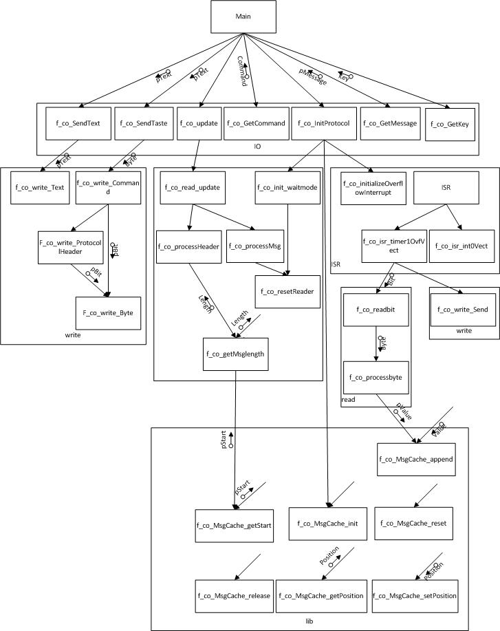

Alle Struktogramme:

---
co_io - funktionen

### void f_co_SendTaste

### void f_co_SendText

### void f_co_InitProtocol

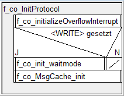

### uint8_t* f_co_GetMessage

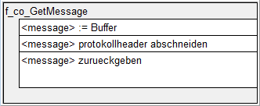

### uint8_t f_co_GetCommand

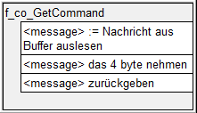

### uint8_t f_co_GetKey

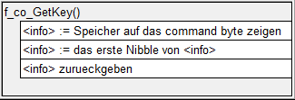

### void f_co_update

---
co_read

### void f_co_init_waitmode

### void f_co_readbit

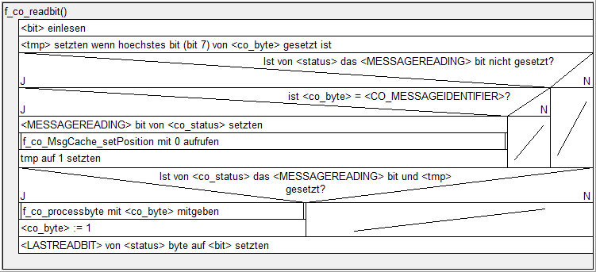

### void f_co_processbyte

### void void f_co_processMsg

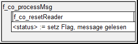

### void f_co_processHeader

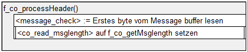

### void f_co_resetReader

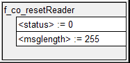

### uint8_t f_co_getMsglength

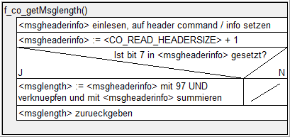

--
co_write - funktionen

### void f_co_write_Text

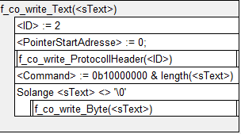

### void f_co_write_Send

### void f_co_write_Command

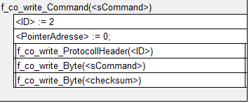

### void f_co_write_ProtocollHeader

### bool f_co_write_Byte

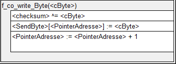

### bool f_co_write_Controll

---
co_isr

### f_co_initializeOverflowInterrupt

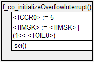

### f_co_isr_timer1OvfVect

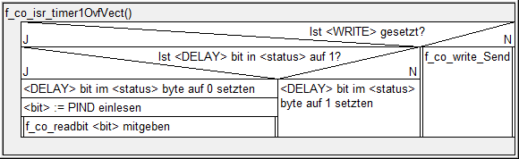

### f_co_isr_int0Vect

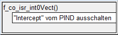

---
co_lib - funktionen

### f_co_MsgCache_release

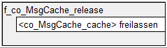

### f_co_MsgCache_init

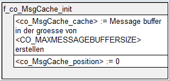

### f_co_MsgCache_append

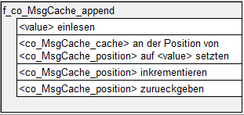

### f_co_MsgCache_setPosition

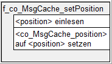

### f_co_MsgCache_getPosition

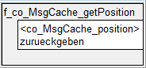

### f_co_MsgCache_reset

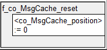

### f_co_MsgCache_getStart

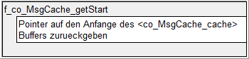

## API

Die Funktionsbeschreibungen und Dokumentation ist unter folgendem link zu finden:
[http://bigz94.github.io/comprotocol/doc/doxy/html/index.html](http://bigz94.github.io/comprotocol/doc/doxy/html/co_8h.html)
