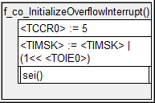
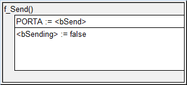
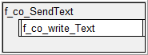
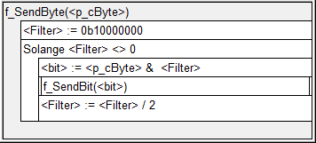
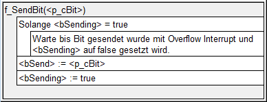
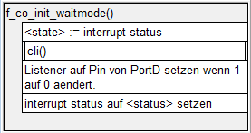
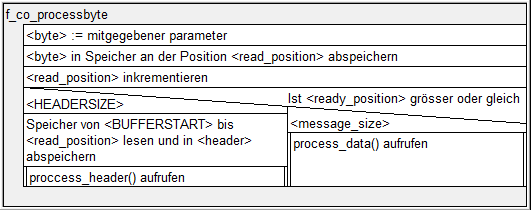

# Protokoll Beschreibung (comprotocol)
===========

Ein sehr einfach gehaltenes Kommunikationsprotokoll. Das Protokoll wird für schulische Zwecke genutzt und dient zum lernen.

code api

## Protokoll Aufbau

Des Prtokoll ist wie folgt aufgebaut:

1. Entweder kann man einfach einen Command senden

|| 1 Byte              |
|--:| :-----------------: |
|1| initialisierung     |
|2| Ziel ID             |
|3| Source ID           |
|4| command (max 127)   |
|5| Checksumme          |

2. Oder einen Text übermitteln

|| 1 Byte               |
|--:| :---------------: |
|1| Initialisierung    |
|2| Ziel ID             |
|3| Source ID           |
|4| command(text) + textlänge  |
|5| TEXT (max 128byte)  |
|6| Checksumme          |

### Keine Übermittlung

Bei keiner Überittlung wird die Verbindung immer auf 1 gehalten.
Wichtig beim lesen und schreiben von Nachrichten muss dieser Wert umgekehrt (1 auf 0) gesetzt werden.
Bei dieser Dokumentation wird davon ausgegangen, dass das ausgehende oder eingehende Byte bereits umgekehrt, also 0 bei keinem Senden erhält.

### Initialisierung(#Initialisierung)

Um zu erkennen, dass eine Nachricht übermittelt wird, wird ein Initialisierungs Byte genutzt.
Dieses muss immer **1010 1010** betragen. Dies wird einheitlich bei allen Kontrollern, die dieses Protokoll nutzen.

### Ziel ID

Die Ziel ID ist eine 1 Byte grosse Zahl, die genutzt wird um zu erkennen, an wen man die Nachticht senden möchte.

### Source ID 

Die Source ID wird genutzt um zu erkenne, von wem die Nachricht ist und an wen man antworten sollte, sollte eine Antwort benötigt werden.

### Command übermitteln

Beim Command übermitteln wird bei dem command byte(4) das erste byte auf 0 gesetzt. Die restlichen können zur übermittlung des Commands genutzt werden.

#### Kurze Command list

Hier eine kurze liste der haupt commands. Das Protokoll wurde dafür gebaut, damit man jederzeit eigene commands hinzufügen kann.

| byte | name |
| ---- | ---- |
| 000 0001 | Okey |
| 000 0010 | Fehler: Neu senden |

### Text übermitteln

Beim Übermitteln eines Textes wird beim command byte(4) des erste byte auf 1 gesetzt und die restlichen bytes dafür genutzt, um die grösse der kommenden Nachricht zu übermitteln.

### Checksum

Benörigt um die erhaltenen bytes zu kontrollieren. Die checksumme ermöglicht es zu erkennen, ob ein fehler bei der Übermittlung entschaden ist.

Die Checksumme wird erstellt indem man alle zuvor gesendeten bytes XOR miteinander verknüpft.

## Structure chart

Das *structure chart* aller Funktionen:

## Funktionen Struktugram

Alle Struktogramme:

### f_co_initializeOverflowInterrupt

### f_co_send

### f_co_sendText

### f_co_sendByte

### f_co_sendBit

### f_co_init_waitmode

### f_co_update

### f_co_processbyte

## API

Die Funktionsbeschreibungen und Dokumentation ist unter folgendem link zu finden:
[http://bigz94.github.io/comprotocol/doc/doxy/html/index.html](http://bigz94.github.io/comprotocol/doc/doxy/html/index.html)
